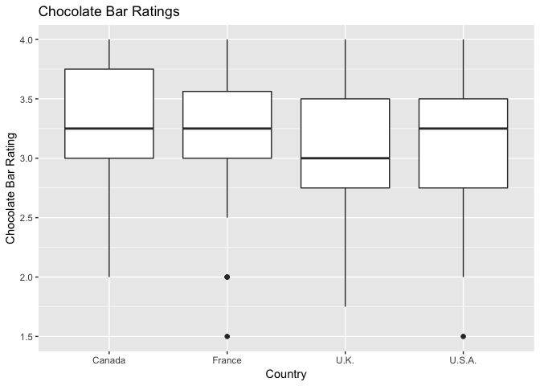

```r
# Be sure to use your file menus at the top of R-Studio to:
# "Session -> Set working directory -> To source file location"
# Then play this chunk and the next one to get the data into R.
library(mosaic)
library(car)
library(DT)
library(pander)
library(readr)
library(plotly)
library(tidyverse)
choc <- read_csv("~/Documents/Math_325/Data/Chocolate.csv")


mylocs <- table(choc$Location) 
mylocnames <- names(mylocs[mylocs>90])
choc.loc <- subset(choc, Location %in% mylocnames)
```


#[Kaggle.com](https://www.kaggle.com/rtatman/chocolate-bar-ratings/data)


## Chocolate Ratings {.tabset .tabset-fade}


### Background
<div>

This analysis used the Chocolate dataset from Kaggle. The dataset included (among other things) different types of chocolate from 60 different countries rated on a scale of 1 to 5. I chose to narrow my search down to the four countries with the most samples of chololate given in the study. This lead to only using data from Canada, France, the U.K., and the United States.

$$
  H_0:  \text{All samples are from the same distribution}
$$
$$
  H_a:  \text{At least one sample's distribution is stochastically different}
$$


 I used a Kruskal-Wallis Test with a level of significance of .05 to evaluate if at least one of these four countries came from a different population than the rest based on their chocolate quality rating. The rating scale used is shown below.

Rating: Expert rating of the bar:
 
  5= Elite (Transcending beyond the ordinary limits)
  
  4= Premium (Superior flavor development, character and style)
  
  3= Satisfactory(3.0) to praiseworthy(3.75) (well made with special qualities)
  
  2= Disappointing (Passable but contains at least one significant flaw)
  
  1= Unpleasant (mostly unpalatable)

*Note that only two samples from the entire dataset were rated above 4 so we will consider the Premium rating a noteworthy accomplishment instead of being just second-best.*
  
   
</div>

### Analysis
<div>

Preforming a Kruskal-Wallis test veryfied that at least one of the four countries comes from a different population than the others. However, this is rather uninformative as we still are missing a large amount of information. We don't know which country is different than that others, if there is more than one country in this category, or if that country has better or worse chocolate than the others. All we know is that the data is worth a deeper investigation.


```r
pander(kruskal.test(data=choc.loc, as.factor(Rating)~as.factor(Location)))
```


--------------------------------------
 Test statistic   df      P value     
---------------- ---- ----------------
     26.63        3    7.05e-06 * * * 
--------------------------------------

Table: Kruskal-Wallis rank sum test: `as.factor(Rating)` by `as.factor(Location)`

Using a boxplot to give insights into the aforementioned shortcomings of the information provided by the Kruskal-Wallis test led to some interesting revelations. 


```r
#plot_ly(data=choc.loc, x=~Location, y=~Rating, type="box") %>%
#  layout(
#    title = "Chocolate Bar Ratings",
#    xaxis = list(title = "Country"),
#    yaxis = list(title = "Chocolate Bar Rating",
#                 range=c(0,4), 
#                 tickvals=seq(1,4,1), 
#                 tickmode="array"))

choc.loc %>%
ggplot(aes(x = Location, y = Rating)) +
  geom_boxplot() +
  labs( title = "Chocolate Bar Ratings", x = "Country", y = "Chocolate Bar Rating")
```

<!-- -->

```r
ggsave("Chocolate Bar Ratings.png")
```

I had assumed that the different country would have better ratings than the others, but my assumption is that the outliers may have actually had slightly lower rater chocolate. Three of the countries had a median rating of 3.25 while the U.K. had a slightly lower median rating could be the different population. The other possiblity is that Canada is the different population since their chocolate has a higher third quantile than the others.


```r
pander(choc.loc %>%
  group_by(Location) %>%
  summarize( Num_of_Samples= n(),
             Median_Rating= median(Rating),
             Max_Rating= as.integer(max(Rating)),
             Third_Quantile= quantile(Rating,.75)))
```


-------------------------------------------------------------------------
 Location   Num_of_Samples   Median_Rating   Max_Rating   Third_Quantile 
---------- ---------------- --------------- ------------ ----------------
  Canada         124             3.25            4             3.75      

  France         156             3.25            4            3.562      

   U.K.           96               3             4             3.5       

  U.S.A.         764             3.25            4             3.5       
-------------------------------------------------------------------------

While this indicates that the U.K. produces lower quality chocolate than Canada, France and the United States, the Kruskal-Wallis test has revealed only that this data is worth further investigation. There is no way to know more without a deeper and more specific analysis.

<div>
