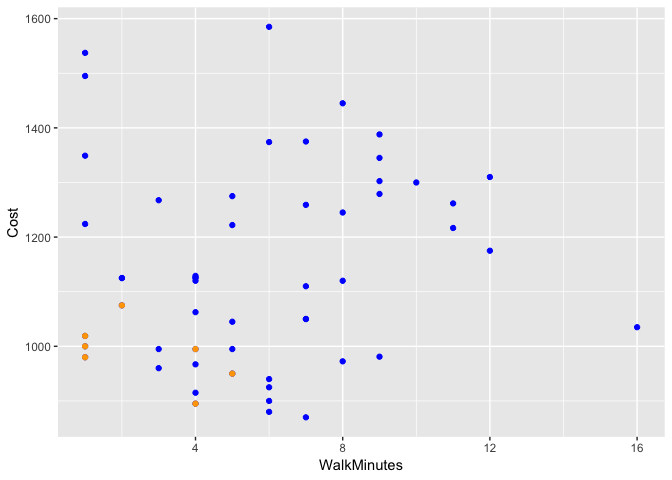

<br />

## Background

Stephanie[^1] is a student that will be starting school at BYU-Idaho next semester. Here is a copy of the email request for information that she sent.

"Hi. My name is Stephanie. I would like to learn about what housing options I have for living at BYU-Idaho next semester. It will be my first semester there, so I would like to find something that is close to campus and around $300 a month in rent. I'm not too picky on roomates, but I would like somewhere that has a lot of people around so I can get to know as many people as possible. Thanks in advance!"


<!-- Hint, you should probably subset the Rent dataset to only show the "Approved Women's Housing" since Stephanie won't be interested in Male Housing options. Also, you can edit this background however you wish when completing your analysis. Notice how this text in green doesn't show up in the HTML output because we used the HTML comment tags around this text. --> 

## Response to Question
Stephanie, after considering your request I have made the following chart for your use in deciding where you would most like to live in Rexburg. There are 57 total Women's apartments in Rexburg, but not all of them fit into what you are looking for.

With a budget of 300 dollars each month for housing you will spend a total of 1050 dollars each semester as each semester is 3.5 months long. You requested somewhere to live close to campus, so I looked for housing within a five minute walk of campus. You also wanted to live somewhere with lots of other students around, so I looked for apartment complexes with at least 50 students. These are the complexes I found.

The following chart shows all of the Approved Women's Housing in blue with my recommendations in orange. Each dot represents an apartment complex with the size of the dot increasing based on how many people live in each complex. You may scroll over each point to see specifics on each apartment complex.


```r
library(plotly)
plot_ly() %>%
  add_trace(data=w_rent,x=~WalkMinutes,y=~Cost, type="scatter",
            size=~Residents,text=~paste(Apartment,'<br># Residents: ',Residents),
            name='All Approved Housing') %>%
  add_trace(data=ideal,x=~WalkMinutes,y=~Cost, type="scatter",
            size=~Residents,text=~paste(Apartment,'<br># Residents: ',Residents),
            name='Housing within Criteria') %>%
  layout(title='Approved Women\'s Housing',
         yaxis=list(title='Cost per Semester'),
         xaxis=list(title='Distance from Campus (in Minutes)'),
         legend=list(x=.6,y=.9))
```

<!--html_preserve--><div id="980f580b6cec" style="width:672px;height:480px;" class="plotly html-widget"></div>
<script type="application/json" data-for="980f580b6cec">{"x":{"visdat":{"980f6062563b":["function () ","plotlyVisDat"],"980f561c271c":["function () ","data"],"980f524bcb6e":["function () ","data"]},"cur_data":"980f524bcb6e","attrs":{"980f561c271c":{"alpha":1,"sizes":[10,100],"x":{},"y":{},"type":"scatter","size":{},"text":{},"name":"All Approved Housing"},"980f524bcb6e":{"alpha":1,"sizes":[10,100],"x":{},"y":{},"type":"scatter","size":{},"text":{},"name":"Housing within Criteria"}},"layout":{"margin":{"b":40,"l":60,"t":25,"r":10},"title":"Approved Women's Housing","yaxis":{"domain":[0,1],"title":"Cost per Semester"},"xaxis":{"domain":[0,1],"title":"Distance from Campus (in Minutes)"},"legend":{"x":0.6,"y":0.9},"hovermode":"closest","showlegend":true},"source":"A","config":{"modeBarButtonsToAdd":[{"name":"Collaborate","icon":{"width":1000,"ascent":500,"descent":-50,"path":"M487 375c7-10 9-23 5-36l-79-259c-3-12-11-23-22-31-11-8-22-12-35-12l-263 0c-15 0-29 5-43 15-13 10-23 23-28 37-5 13-5 25-1 37 0 0 0 3 1 7 1 5 1 8 1 11 0 2 0 4-1 6 0 3-1 5-1 6 1 2 2 4 3 6 1 2 2 4 4 6 2 3 4 5 5 7 5 7 9 16 13 26 4 10 7 19 9 26 0 2 0 5 0 9-1 4-1 6 0 8 0 2 2 5 4 8 3 3 5 5 5 7 4 6 8 15 12 26 4 11 7 19 7 26 1 1 0 4 0 9-1 4-1 7 0 8 1 2 3 5 6 8 4 4 6 6 6 7 4 5 8 13 13 24 4 11 7 20 7 28 1 1 0 4 0 7-1 3-1 6-1 7 0 2 1 4 3 6 1 1 3 4 5 6 2 3 3 5 5 6 1 2 3 5 4 9 2 3 3 7 5 10 1 3 2 6 4 10 2 4 4 7 6 9 2 3 4 5 7 7 3 2 7 3 11 3 3 0 8 0 13-1l0-1c7 2 12 2 14 2l218 0c14 0 25-5 32-16 8-10 10-23 6-37l-79-259c-7-22-13-37-20-43-7-7-19-10-37-10l-248 0c-5 0-9-2-11-5-2-3-2-7 0-12 4-13 18-20 41-20l264 0c5 0 10 2 16 5 5 3 8 6 10 11l85 282c2 5 2 10 2 17 7-3 13-7 17-13z m-304 0c-1-3-1-5 0-7 1-1 3-2 6-2l174 0c2 0 4 1 7 2 2 2 4 4 5 7l6 18c0 3 0 5-1 7-1 1-3 2-6 2l-173 0c-3 0-5-1-8-2-2-2-4-4-4-7z m-24-73c-1-3-1-5 0-7 2-2 3-2 6-2l174 0c2 0 5 0 7 2 3 2 4 4 5 7l6 18c1 2 0 5-1 6-1 2-3 3-5 3l-174 0c-3 0-5-1-7-3-3-1-4-4-5-6z"},"click":"function(gd) { \n        // is this being viewed in RStudio?\n        if (location.search == '?viewer_pane=1') {\n          alert('To learn about plotly for collaboration, visit:\\n https://cpsievert.github.io/plotly_book/plot-ly-for-collaboration.html');\n        } else {\n          window.open('https://cpsievert.github.io/plotly_book/plot-ly-for-collaboration.html', '_blank');\n        }\n      }"}],"cloud":false},"data":[{"x":[16,8,4,8,5,1,7,6,9,5,3,1,1,5,10,7,12,6,11,2,1,1,5,8,8,5,11,6,4,7,9,4,7,4,6,3,1,4,6,9,9,3,1,7,4,12,4,4,2,7,4,9,2,6],"y":[1035,1445,1062.5,972.5,1045,1000,1050,900,1345,1222,960,980,1019,1275,1300,870,1310,925,1216.666666,1075,1495,1349,995,1245,1120,950,1261.666666,940,895,1375,981,1120,1259,1125,880,1267.5,1224,1129,1374,1388,1279,995,1537.333333,1050,1126,1175,995,915,1125,1110,967,1302.5,1125,1585],"type":"scatter","text":["ABBY LANE MANOR <br># Residents:  42","ABRI APARTMENTS - WOMEN <br># Residents:  150","ALBION APARTMENT <br># Residents:  5","ALEXANDER APARTMENT <br># Residents:  22","ALLDREDGE HOUSE  <br># Residents:  8","ALLEN'S SUNRISE VILLAGE - WOMEN <br># Residents:  144","AMERICAN AVENUE - WOMEN <br># Residents:  165","ASPEN VILLAGE - WOMEN <br># Residents:  210","AUTUMN WINDS <br># Residents:  96","AVONLEA APARTMENTS <br># Residents:  60","BAYSIDE MANOR <br># Residents:  8","BIRCH PLAZA <br># Residents:  343","BIRCH WOOD I <br># Residents:  65","BIRCH WOOD II <br># Residents:  24","BRIGHTON APARTMENTS-WOMEN <br># Residents:  60","BROOKLYN APARTMENTS <br># Residents:  144","BROOKSIDE VILLAGE - WOMEN <br># Residents:  86","BUENA VISTA <br># Residents:  21","CAMDEN APARTMENTS-WOMEN <br># Residents:  53","CARRIAGE HOUSE <br># Residents:  234","CEDARS, THE-WOMEN <br># Residents:  444","CENTRE SQUARE-WOMEN <br># Residents:  546","COLLEGE AVENUE APARTMENTS <br># Residents:  9","COLONIAL HOUSE <br># Residents:  342","CONDIE COTTAGE <br># Residents:  6","COTTONWOOD-WOMEN <br># Residents:  84","CREEKSIDE COTTAGES - WOMEN <br># Residents:  24","CRESTWOOD COTTAGE <br># Residents:  10","DAVENPORT APARTMENTS <br># Residents:  71","GATES, THE - WOMEN <br># Residents:  324","GREENBRIER SOUTH <br># Residents:  92","HEMMING HOUSE I <br># Residents:  9","HERITAGE WOMEN <br># Residents:  192","HILLCREST TOWNHOUSES <br># Residents:  140","HILL'S COLLEGE AVE APTS <br># Residents:  11","IVY, THE - Women <br># Residents:  636","KENSINGTON MANOR - WOMEN <br># Residents:  108","LA JOLLA - WOMEN <br># Residents:  234","LEGACY RIDGE <br># Residents:  288","MOUNTAIN LOFTS - WOMEN <br># Residents:  590","NAUVOO HOUSE II <br># Residents:  338","NORMANDY APARTMENTS <br># Residents:  40","NORTHPOINT - WOMEN <br># Residents:  548","PARK VIEW APTS - WOMEN <br># Residents:  32","RED BRICK HOUSE <br># Residents:  5","ROOST, THE - WOMEN <br># Residents:  114","ROYAL CREST <br># Residents:  342","SHADETREE APARTMENT <br># Residents:  6","SNOWVIEW APARTMENTS <br># Residents:  64","SOMERSET APARTMENTS - WOMEN <br># Residents:  180","SUNSET HALL <br># Residents:  14","TUSCANY PLACE - WOMEN <br># Residents:  142","WEBSTER HOUSE <br># Residents:  9","WINDSOR MANOR-WOMEN <br># Residents:  208"],"name":"All Approved Housing","mode":"markers","marker":{"size":[15.2773375594295,30.6814580031696,10,12.4247226624406,10.4278922345483,29.8256735340729,32.8209191759113,39.2393026941363,22.9793977812995,17.8446909667195,10.4278922345483,58.2091917591125,18.5578446909667,12.7099841521395,17.8446909667195,29.8256735340729,21.5530903328051,12.2820919175911,16.8462757527734,42.662440570523,72.6148969889065,87.1632329635499,10.5705229793978,58.0665610142631,10.1426307448494,21.2678288431062,12.7099841521395,10.7131537242472,19.4136291600634,55.4992076069731,22.4088748019017,10.5705229793978,36.6719492868463,29.2551505546751,10.8557844690967,100,24.6909667194929,42.662440570523,50.364500792393,93.4389857369255,57.4960380348653,14.9920760697306,87.4484944532488,13.851030110935,10,25.5467511885895,58.0665610142631,10.1426307448494,18.4152139461173,34.9603803486529,11.283676703645,29.540412044374,10.5705229793978,38.9540412044374],"sizemode":"area","fillcolor":"rgba(31,119,180,1)","color":"rgba(31,119,180,1)","line":{"color":"transparent"}},"xaxis":"x","yaxis":"y","frame":null},{"x":[1,1,1,2,5,4,4],"y":[1000,980,1019,1075,950,895,995],"type":"scatter","text":["ALLEN'S SUNRISE VILLAGE - WOMEN <br># Residents:  144","BIRCH PLAZA <br># Residents:  343","BIRCH WOOD I <br># Residents:  65","CARRIAGE HOUSE <br># Residents:  234","COTTONWOOD-WOMEN <br># Residents:  84","DAVENPORT APARTMENTS <br># Residents:  71","ROYAL CREST <br># Residents:  342"],"name":"Housing within Criteria","mode":"markers","marker":{"size":[29.8256735340729,58.2091917591125,18.5578446909667,42.662440570523,21.2678288431062,19.4136291600634,58.0665610142631],"sizemode":"area","fillcolor":"rgba(255,127,14,1)","color":"rgba(255,127,14,1)","line":{"color":"transparent"}},"xaxis":"x","yaxis":"y","frame":null}],"highlight":{"on":"plotly_click","persistent":false,"dynamic":false,"selectize":false,"opacityDim":0.2,"selected":{"opacity":1}},"base_url":"https://plot.ly"},"evals":["config.modeBarButtonsToAdd.0.click"],"jsHooks":{"render":[{"code":"function(el, x) { var ctConfig = crosstalk.var('plotlyCrosstalkOpts').set({\"on\":\"plotly_click\",\"persistent\":false,\"dynamic\":false,\"selectize\":false,\"opacityDim\":0.2,\"selected\":{\"opacity\":1}}); }","data":null}]}}</script><!--/html_preserve-->

```r
  ggplot() +
  geom_point(data = w_rent, aes( x = WalkMinutes, y = Cost), color = "blue") +
  geom_point(data = ideal, aes( x = WalkMinutes, y = Cost), color = "orange")
```

<!-- -->


Of all of the apartments in Rexburg, only 7 fit within the given constraints. You have many other housing options near campus and the largest cluster of apartments are all within a 6 minute walk of campus and under $1,100. However, not all meet your desire to live in the same complex as many other students.

```r
chosen<-select(ideal,Apartment,Phone,Cost,Residents)
pander(head(chosen,n=7))
```


---------------------------------------------------------------
         Apartment               Phone        Cost   Residents 
--------------------------- ---------------- ------ -----------
 ALLEN'S SUNRISE VILLAGE -    208-356-3995    1000      144    
           WOMEN                                               

        BIRCH PLAZA          (208) 359-8200   980       343    

       BIRCH WOOD I          (208) 359-8200   1019      65     

      CARRIAGE HOUSE          208-356-4361    1075      234    

     COTTONWOOD-WOMEN        (208) 356-9576   950       84     

   DAVENPORT APARTMENTS       208-356-3216    895       71     

        ROYAL CREST           208-356-7778    995       342    
---------------------------------------------------------------

While this analysis was done for an assignment, it was interesting to notice that there seems to be little to no relationship between how far away an apartment complex is from campus and their price. This means an investor could build a complex further away from campus where it is cheaper and still charge as much anyone else, if not more. This claim can be confirmed with the linear regression model below where WalkMinutes is used to predict Cost. The R squared value is practically 0 and the P value is far too high to confirm any reasonable confidence level.


```r
housing_lm <- lm(data = w_rent, Cost ~ WalkMinutes)
summary(housing_lm)
```

```
## 
## Call:
## lm(formula = Cost ~ WalkMinutes, data = w_rent)
## 
## Residuals:
##     Min      1Q  Median      3Q     Max 
## -280.20 -140.54   -9.22  124.36  441.32 
## 
## Coefficients:
##             Estimate Std. Error t value Pr(>|t|)    
## (Intercept) 1104.587     49.542  22.296   <2e-16 ***
## WalkMinutes    6.516      7.475   0.872    0.387    
## ---
## Signif. codes:  0 '***' 0.001 '**' 0.01 '*' 0.05 '.' 0.1 ' ' 1
## 
## Residual standard error: 181.9 on 52 degrees of freedom
##   (3 observations deleted due to missingness)
## Multiple R-squared:  0.0144,	Adjusted R-squared:  -0.004551 
## F-statistic: 0.7599 on 1 and 52 DF,  p-value: 0.3874
```


[^1]: Note that Stephanie is a fictional character who is based on real experiences of many faculty and staff here at BYU-Idaho.
