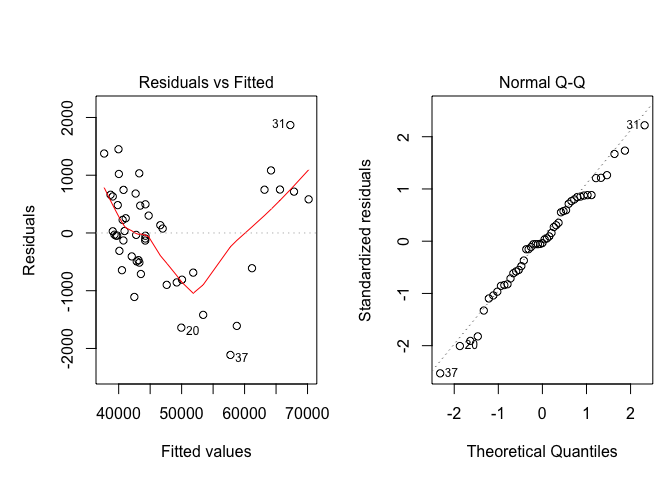
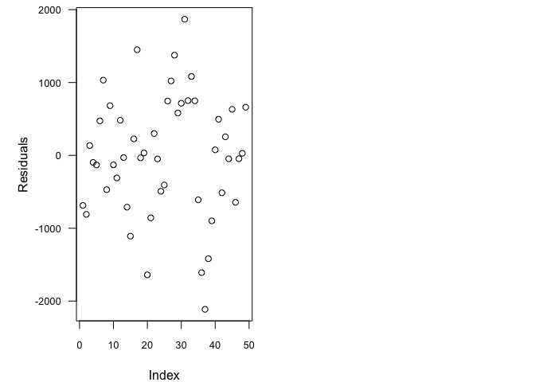
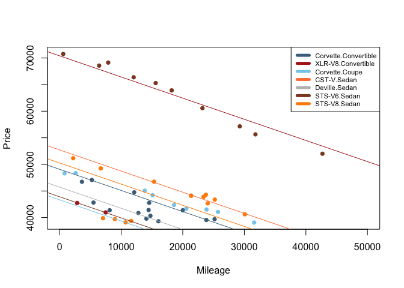

<br>

## Background

For my analysis I chose to look into the relationship between car price and mileage for the most expensive cars taking make, model and type into consideration using the CarPrices data frame. I ended up with a dataset with 49 rows of cars which cost at least $39,000. My model for the multiple linear regression I will perform is listed below:

$$
  Y_i = \beta_0 + \beta_1 X_{i1} + \beta_2 X_{i2} + \beta_3 X_{i3} + \beta_4 X_{i4} + \beta_5 X_{i5} + \beta_6 X_{i6} + \beta_7 X_{i7}+ \epsilon_i
$$
$$
  α = 0.05
$$


| Coefficient | X-Variable   |  Meaning  |
|---------|----------|-------------------------------------------------|
$\beta_0$  |  | The average cost of a Corvette Convertable with zero miles |
 $\beta_1$\rule{0pt}{16pt}  | $X_{i1} =$ Vehicle Mileage | Effect of each mile on average price |[4pt]
 $\beta_2$   |  $X_{i2} = \left\{\begin{array}{ll} 1, & \text{if Model} = \text{CTS-V} \\ 0, & \text{if Model}\neq \text{CTS-V} \end{array}\right.$ | How much more or less a CST-V Sedan costs on average over a Corvette Convertable |
 $\beta_3$   |  $X_{i3} = \left\{\begin{array}{ll} 1, & \text{if Model} = \text{Deville} \\ 0, & \text{if Model}\neq \text{Deville} \end{array}\right.$ | How much more or less a Deville Sedan costs on average over a Corvette Convertable |
 $\beta_4$   |  $X_{i4} = \left\{\begin{array}{ll} 1, & \text{if Model} = \text{STS-V6} \\ 0, & \text{if Model}\neq \text{STS-V6} \end{array}\right.$ | How much more or less a STS-V6 Sedan costs on average over a Corvette Convertable |
 $\beta_5$   |  $X_{i5} = \left\{\begin{array}{ll} 1, & \text{if Model} = \text{STS-V8} \\ 0, & \text{if Model}\neq \text{STS-V8} \end{array}\right.$ | How much more or less a STS-V8 Sedan costs on average over a Corvette Convertable |
 $\beta_6$   |  $X_{i6} = \left\{\begin{array}{ll} 1, & \text{if Model} = \text{XLR-V8} \\ 0, & \text{if Model}\neq \text{XLR-V8} \end{array}\right.$ | How much more or less a XLR-V8 Convertable costs on average over a Convertable Corvette |
 $\beta_7$   |  $X_{i7} = \left\{\begin{array}{ll} 1, & \text{if Model} = \text{Corvette Coupe} \\ 0, & \text{if Model}\neq \text{Corvette Coupe} \end{array}\right.$ | How much more or less a Corvette Coupe costs on average over a Corvette Convertable |


```r
# Be sure to download the CarPrices.csv file and save it
# into your Data folder prior to knitting this file.

library(pander)
library(tidyverse)
library(plotly)
library(mosaic)
CarPrices <- read.csv("~/Documents/Math_325/Data/CarPrices.csv", header=TRUE)
CarPrices.Ex <- droplevels(filter(CarPrices,Price>= 39000))
CarType.Ex.lm <- lm(data=CarPrices.Ex, Price~Mileage + interaction(Model,Type))
# Remember, to get the CarPrices data into your Console you have
# to use the "Import Dataset" option in the "Environment" window.
```
## Statistical Analysis

Before continuing on with this analysis a simple qq-plot inspection shows that this data is fairly normal and we are safe to continue on with investigating this dataset.


```r
par(mfrow=c(1,2), mai=c(1,1,1,.2))
 plot(CarType.Ex.lm, which=1:2)
```

<!-- -->

```r
 par(mai=c(.8,1,0.1,.2))
plot(CarType.Ex.lm$residuals, ylab="Residuals", las=1, cex.axis=.8)
```

<!-- -->

After performing a linear regression test I have found that every car tyoe had a P-value which indicated a need to fail to reject the idea that there is no relationship between price and mileage after taking make, model and type into consideration. Every other car showed some form of relationship.


```r
summary(CarType.Ex.lm)
```

```
## 
## Call:
## lm(formula = Price ~ Mileage + interaction(Model, Type), data = CarPrices.Ex)
## 
## Residuals:
##      Min       1Q   Median       3Q      Max 
## -2112.30  -513.35   -29.96   631.70  1868.59 
## 
## Coefficients:
##                                              Estimate Std. Error t value
## (Intercept)                                 4.907e+04  4.091e+02 119.942
## Mileage                                    -3.978e-01  1.506e-02 -26.411
## interaction(Model, Type)XLR-V8.Convertible  2.133e+04  4.493e+02  47.472
## interaction(Model, Type)Corvette.Coupe     -5.747e+03  5.725e+02 -10.038
## interaction(Model, Type)CST-V.Sedan         3.644e+03  4.505e+02   8.087
## interaction(Model, Type)Deville.Sedan      -3.355e+03  4.850e+02  -6.916
## interaction(Model, Type)STS-V6.Sedan       -5.166e+03  7.398e+02  -6.983
## interaction(Model, Type)STS-V8.Sedan        1.190e+03  4.567e+02   2.605
##                                            Pr(>|t|)    
## (Intercept)                                 < 2e-16 ***
## Mileage                                     < 2e-16 ***
## interaction(Model, Type)XLR-V8.Convertible  < 2e-16 ***
## interaction(Model, Type)Corvette.Coupe     1.31e-12 ***
## interaction(Model, Type)CST-V.Sedan        5.04e-10 ***
## interaction(Model, Type)Deville.Sedan      2.16e-08 ***
## interaction(Model, Type)STS-V6.Sedan       1.74e-08 ***
## interaction(Model, Type)STS-V8.Sedan         0.0127 *  
## ---
## Signif. codes:  0 '***' 0.001 '**' 0.01 '*' 0.05 '.' 0.1 ' ' 1
## 
## Residual standard error: 904.2 on 41 degrees of freedom
## Multiple R-squared:  0.9915,	Adjusted R-squared:   0.99 
## F-statistic: 682.5 on 7 and 41 DF,  p-value: < 2.2e-16
```


```r
palette(c("skyblue4","firebrick","skyblue","sienna1","gray","sienna4","darkorange"))
plot(Price ~ Mileage, data=CarPrices.Ex, pch=16, col=interaction(Model, Type), xlim=c(0,50000))
abline(CarType.Ex.lm$coef[1]                      , CarType.Ex.lm$coef[2], col=palette()[1])
abline(CarType.Ex.lm$coef[1]+CarType.Ex.lm$coef[3], CarType.Ex.lm$coef[2], col=palette()[2])
abline(CarType.Ex.lm$coef[1]+CarType.Ex.lm$coef[4], CarType.Ex.lm$coef[2], col=palette()[3])
abline(CarType.Ex.lm$coef[1]+CarType.Ex.lm$coef[5], CarType.Ex.lm$coef[2], col=palette()[4])
abline(CarType.Ex.lm$coef[1]+CarType.Ex.lm$coef[6], CarType.Ex.lm$coef[2], col=palette()[5])
abline(CarType.Ex.lm$coef[1]+CarType.Ex.lm$coef[7], CarType.Ex.lm$coef[2], col=palette()[6])
abline(CarType.Ex.lm$coef[1]+CarType.Ex.lm$coef[8], CarType.Ex.lm$coef[2], col=palette()[7])
legend("topright",CarType.Ex.lm$xlevels$`interaction(Model, Type)`, lty=1, lwd=5, col=palette(), cex=0.7)
```

<!-- -->


```r
#ggtrend <-ggplot(data=CarPrices.Ex, aes(x=Mileage, y=Price, col=Model:Type)) +
 # geom_point() + stat_smooth(method="lm", se=FALSE, fullrange = T) + 
  #ggtitle("Price of Cars by Model and Type")
#ggplotly(ggtrend)
```


