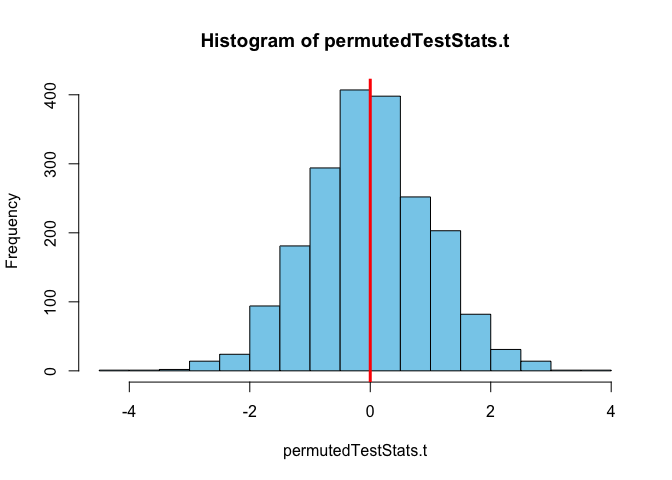

```r
library(plotly)
library(pander)
library(tidyverse)
library(mosaic)
library(lubridate)
library(pander)
```


```r
z_kwh<-(Utilities$kwh-mean(Utilities$kwh))/sd(Utilities$kwh)
z_ccf<-(Utilities$ccf-mean(Utilities$ccf))/sd(Utilities$ccf)
```


```r
late <- read.csv("~/Documents/M325_Git/Data/late.csv", header=TRUE)
Late <- reshape(late,
                varying = paste("Week",1:20, sep=""), 
                v.names = "No.ofLateChildren",
                timevar = "Week", 
                times = 1:20, 
                idvar = "Center",
                new.row.names = 1:200,
                direction = "long")
Late$Period <- cut(Late$Week, c(0,4,16,Inf), labels = c("Pre-Fine","Fine","Post-Fine"))
Late$Proportion<- round(Late$No.ofLateChildren/Late$No.ofChidren,2)
```


```r
AMZN <- read.csv("~/Documents/M325_Git/Data/AMZN-stock.csv")
AMZN$month <- month(strptime(AMZN$Date, format="%Y-%m-%d"))
AMZN$year <- year(strptime(AMZN$Date, format="%Y-%m-%d"))
AMZN$oc_diff <- AMZN$Close-AMZN$Open
AMZN$adj_open <- c(AMZN$Open[-1],NA)
AMZN$adj_close <- c(AMZN$Close[-length(AMZN$Close)],NA)
AMZN$adj_co_diff <- (AMZN$adj_open-AMZN$adj_close)/AMZN$adj_close
AMZN$oc_diff_per <- (AMZN$Close-AMZN$Open)/AMZN$Open
AMZN$co_diff <- AMZN$adj_open-AMZN$adj_close
```


Permutation of T-Test analysis


```r
knitr::opts_chunk$set(warning = FALSE, message = FALSE)

pander((Utilities.Test <- t.test(z_kwh,z_ccf,paired=T)))
```


-----------------------------------------------------------------------------------
 Test statistic   df    P value   Alternative hypothesis   mean of the differences 
---------------- ----- --------- ------------------------ -------------------------
   -1.767e-15     116      1            two.sided                -2.208e-16        
-----------------------------------------------------------------------------------

Table: Paired t-test: `z_kwh` and `z_ccf`

```r
observedTestStat.t <- Utilities.Test$statistic

N <- 2000
permutedTestStats.t <- rep(NA, N)
for (i in 1:N){
  permutedData.t <- sample(x=c(-1,1), size=117, replace=TRUE)
  permutedTest.t <- t.test((z_kwh-z_ccf) * permutedData.t, data = Utilities)
  permutedTestStats.t[i] <- permutedTest.t$statistic
}

hist(permutedTestStats.t, col = "skyblue")
abline(v = observedTestStat.t, col = "red", lwd = 3)
```

<!-- -->

```r
2*sum(permutedTestStats.t <= observedTestStat.t)/N
```

```
## [1] 1.002
```

Permutation of ANOVA analysis


```r
Late.aov <- aov(data=Late,Proportion~Treatment+ Period +Treatment:Period)
observedTestStat.a <- summary(Late.aov)[[1]]$`F value`[1]
pander(summary(Late.aov))
```


---------------------------------------------------------------------
        &nbsp;          Df    Sum Sq   Mean Sq   F value    Pr(>F)   
---------------------- ----- -------- --------- --------- -----------
    **Treatment**        1    1.555     1.555     52.3     1.073e-11 

      **Period**         2    0.743    0.3715     12.49    7.876e-06 

 **Treatment:Period**    2    0.7521    0.376     12.65    6.878e-06 

    **Residuals**       194   5.769    0.02973     NA         NA     
---------------------------------------------------------------------

Table: Analysis of Variance Model

```r
N <- 2000
permutedTestStats.a <- rep(NA, N)
for (i in 1:N){
  permutedData.a <- sample(Late$Proportion)
  permutedTest.a <- aov(permutedData.a ~ Treatment, data = Late)
  permutedTestStats.a[i] <- summary(permutedTest.a)[[1]]$`F value`[1]
}


hist(permutedTestStats.a, col = "skyblue", xlim = c(0,16))
abline(v = observedTestStat.a, col = "red", lwd = 3)
```

<!-- -->

```r
2*sum(permutedTestStats.a >= observedTestStat.a)/N
```

```
## [1] 0
```

Permutation of a linear regression analysis

```r
AMZN_lm <- lm(Close~Open, data=AMZN)
observedTestStat.lm <- summary(AMZN_lm)[[4]][2,3]
pander(summary(AMZN_lm))
```


--------------------------------------------------------------
     &nbsp;        Estimate   Std. Error   t value   Pr(>|t|) 
----------------- ---------- ------------ --------- ----------
 **(Intercept)**    0.101       0.2685     0.3762     0.7068  

    **Open**          1       0.0005056     1978        0     
--------------------------------------------------------------


--------------------------------------------------------------
 Observations   Residual Std. Error   $R^2$    Adjusted $R^2$ 
-------------- --------------------- -------- ----------------
     2119              7.231          0.9995       0.9995     
--------------------------------------------------------------

Table: Fitting linear model: Close ~ Open

```r
N <- 2000
permutedTestStats.lm <- rep(NA, N)
for (i in 1:N){
  permutedData.lm <- sample(AMZN$Open)
  permutedTest.lm <- lm(permutedData.lm ~ Close, data = AMZN)
  permutedTestStats.lm[i] <- summary(permutedTest.lm)[[4]][2,3]
}

hist(permutedTestStats.lm, col = "skyblue")
abline(v = observedTestStat.lm, col = "red", lwd = 3)
```

<!-- -->

```r
2*sum(permutedTestStats.lm >= observedTestStat.lm)/N
```

```
## [1] 0
```

