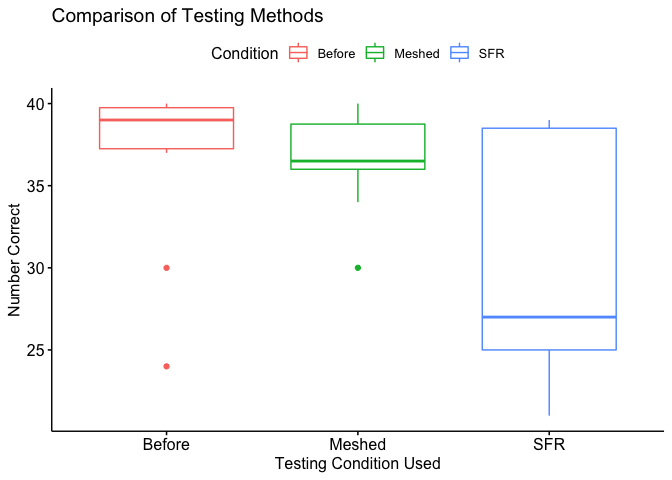
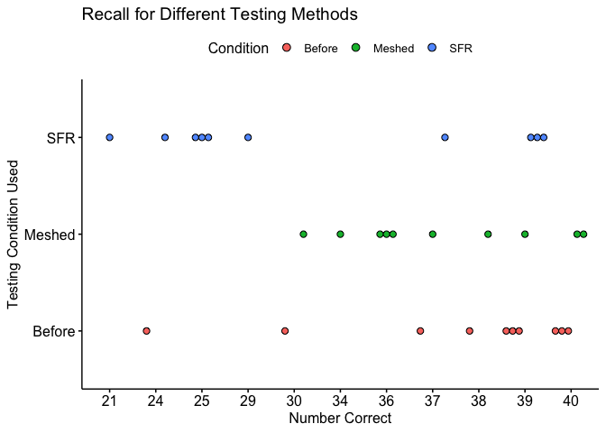

<script type="text/javascript">
 function showhide(id) {
    var e = document.getElementById(id);
    e.style.display = (e.style.display == 'block') ? 'none' : 'block';
 }
</script>


```r
#Variables
Meshed <- subset(Friendly,condition == "Meshed")
Before <- subset(Friendly,condition == "Before")
SFR <- subset(Friendly,condition == "SFR")
```


<br />


##### <a href="javascript:showhide('uniquename')">Preface Information <span style="font-size:8pt;">(click to view)</span></a>


<div id="uniquename" style="display:none;">
## Background
Many teachers and other educators are interested in understanding how to best deliver new content to students. In general, they have two choices of how to do this.

1. The Meshed Approach
    * Deliver new content while simultaneously reviewing previously understood content.

2. The Before Approach
    * Deliver new content after fully reviewing previously understood content.

A study was performed to determine whether the *Meshed* or *Before* approaches to delivering content had any positive benefits on memory recall. 

## The Experiment
Individuals were seated at a computer and shown a list of words. Words appeared on the screen one at a time, for two seconds each, until all words had been shown (40 total). After all words were shown, they were required to perform a few two-digit mathematical additions (like 15 + 25) for 15 seconds to avoid immediate memory recall of the words. They were then asked to write down as many of the 40 words as they could remember. They were given a maximum of 5.3 minutes to recall words.

The process of showing words and recalling words was repeated four times with the same list of words each time (four chances to get it right). The presentation of the first trial was the same for all treatment conditions. However, trials 2, 3, and 4 were slightly different for each treatment condition.

<div style="padding-left:15px;">

The `SFR` group (the control group) stands for Standard Free Recall. In all four trials the same list of 40 words was presented, in a random order each time.

The `Before` group also used the same 40 words during each trial. However, any words that were correctly recalled in a previous trial were presented first, or *before* the words that were not recalled in the last trial. After all the correct words were presented in random order, the non-recalled words were presented in a random order.

The `Meshed` group also used the same 40 words during each trial. However, words that were correctly recalled in a previous trial were alternated with a missed word during the next presentation order. 

</div>

The data records the number of correctly recalled words (out of the 40 possible) from the fourth trial. Results were obtained for 30 students, 10 in each of the three treatment groups: `SFR`, `Before`, and `Meshed`. 

</div>


## My Analysis:


## Pre-Analysis Disclaimer
While the results from this experiment has the potential to be revolutionary in the world of learning, there are some things to take into consideration before going through the data and especially before drawing any conclusions. The first is that there are only ten samples for each test. This is not a large enough sample size to accurately represent the whole population. The other main thing to keep in mind when it comes to seeing numbers or visualizations of the data is that there may be less spread than there first seems to be.
Within this analysis I will be testing both the Before and Meshed methods against SFR with a standard .95 confidence level. Since I am testing two things against SFR each will receive half of α, giving each an α of .025.

## Preliminary Stats
Initial attempts to understand how the SFR, Before, and Meshed methods compare to each other led to the creation of the following basic summary table of the data and a boxplot.


```r
#Summary Table
pander(
  group_by(Friendly, condition) %>%
  summarise(
    count = n(),
    median = median(correct)))
```


----------------------------
 condition   count   median 
----------- ------- --------
  Before      10       39   

  Meshed      10      36.5  

    SFR       10       27   
----------------------------


```r
#Summary Boxplot
ggboxplot(Friendly,
          x = 'condition',
          y = 'correct', 
          color = 'condition',
          ylab = 'Number Correct', 
          xlab = 'Testing Condition Used',
          title = "Comparison of Testing Methods",
          legend.title = "Condition")
```

<!-- -->

```r
ggsave("Comparison of Testing Methods.png")
```
Viewing the boxplot and medians of each learning method it is easy the Before and Meshed testing conditions as vastly superior to SFR. However, quick summary statistics (especially of data with such a small sample size) aren't enough to draw any final conclusions or make any decisions about the data. Because of this we will need to compute wilcoxon tests on the efficiency of these testing conditions.

## Wilcoxon Tests
Below are two Wilcoxon tests. The first is the Before method compared to SFR and the second is the Meshed method against SFR. We will be testing the alternative hypothesis that the Before and Meshed testing conditions are more effective than SFR against the null hypothesis that they are all equally efficient.


```r
# Wilcoxon Test

pander(wilcox.test(Before$correct,SFR$correct,exact=F))
```


-----------------------------------------------------
 Test statistic    P value    Alternative hypothesis 
---------------- ----------- ------------------------
      76.5        0.04555 *         two.sided        
-----------------------------------------------------

Table: Wilcoxon rank sum test with continuity correction: `Before$correct` and `SFR$correct`

```r
pander(wilcox.test(Meshed$correct,SFR$correct,exact=F))
```


---------------------------------------------------
 Test statistic   P value   Alternative hypothesis 
---------------- --------- ------------------------
       72         0.1015          two.sided        
---------------------------------------------------

Table: Wilcoxon rank sum test with continuity correction: `Meshed$correct` and `SFR$correct`
As can be seen, both tests have a P-value above .025, this means that we must fail to reject the null hypothesis. From here the next step would be to either accept that each testing condition is equal to the others (this is the wrong thing to do without deeper investigation), or to test to see if any one testing method is superior to any other one method. 

## Final Thoughts
While it may be surprising that all three testing methods are effective learning conditions, remember that these visualizations can be misleasing as they go from 21 to 40 instead of from 0 to 40. This final visualization will show how close the correct score results are to each other within each test. Courtesy of this dot plot is becomes easy to imagine how a larger sample size would result in filling in the gaps between different points and illuminate any outliers.


```r
ggdotplot(Friendly, 
          y = 'condition',
          x = 'correct',
          fill = 'condition',
          xlab = 'Number Correct', 
          ylab = 'Testing Condition Used',
          title = "Recall for Different Testing Methods",
          legend.title = "Condition")
```

<!-- -->

```r
ggsave("Recall for Different Testing Methods.png")
```

</div>
</div>

<br />


<!-- Begin writing your analysis below here. -->

<!-- Note that your goal is to use the Friendly data to show whether or not the Meshed or Before methods have any positive benefit on memory recall. -->


